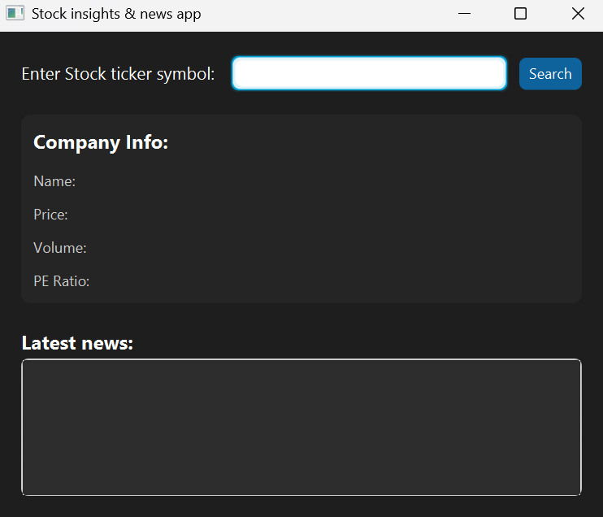
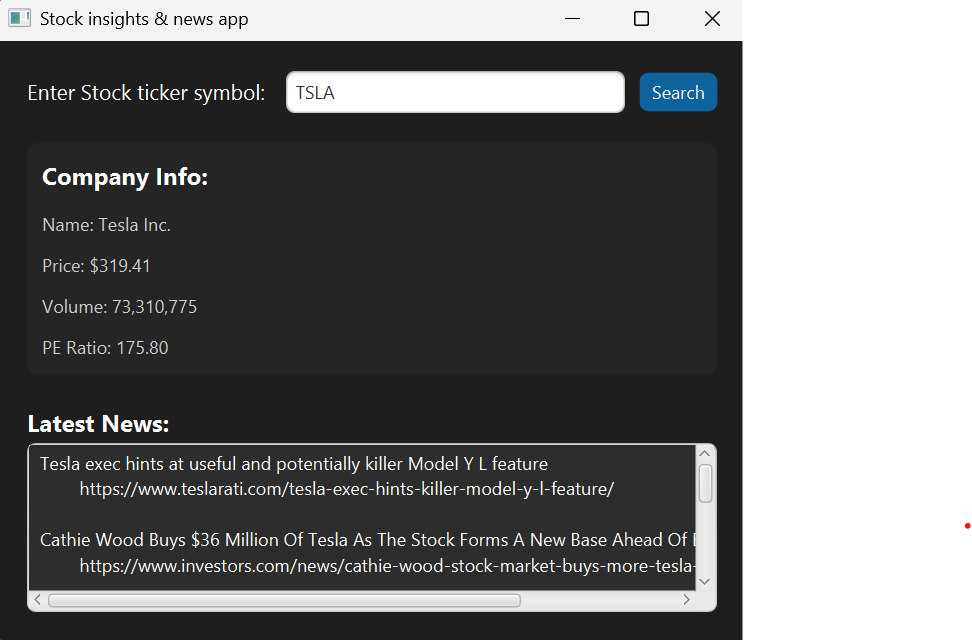

# 📈 Stock Insights & News App

A sleek JavaFX desktop application to get **real-time stock data** and the **latest news headlines** about any company.  

This app fetches stock information (price, volume, P/E ratio) using the **Financial Modeling Prep API** and displays up-to-date articles from the **NewsData API** – all in a clean, modern interface.  

---

## 🌟 Features

- 🔎 **Search by Stock Ticker** (e.g., TSLA, AAPL)
- 📊 Displays **Company Information**
  - Name
  - Current Price
  - Volume
  - P/E Ratio
- 📰 Shows **Latest News Articles** with clickable links
- 🚨 **Error Handling** for invalid stock tickers
- 🌙 **Dark-themed UI** for better readability
- 🖥 Built entirely in **JavaFX** with a focus on clean, modular design

---

## 📂 Project Structure

```
Stock-Insights-App/
├── src/
│ └── main/
│ ├── java/
│ │ └── cs1302/
│ │ └── api/
│ │ ├── ApiApp.java # Main JavaFX application
│ │ ├── OpenLibrarySearchApi.java # Gson API parsing example (reference)
│ └── resources/ # Resource files (if any)
├── pom.xml # Maven project configuration
├── README.md # Project documentation
└── images/
├── StockApp_1.png # Initial screen screenshot
├── StockApp_2.png # Successful lookup screenshot
└── StockApp_3.png # Error handling screenshot
```

---

## 📸 Screenshots

### 🔥 Main Screen (Initial Load)


---

### ✅ Successful Lookup (TSLA)


---

### ❌ Invalid Ticker Handling


---

## 🛠 Tech Stack

- **Java 17**
- **JavaFX**
- **Maven**
- **Gson** (for JSON parsing)
- **Financial Modeling Prep API**
- **NewsData API**

---

## 📚 Learning Highlights

This project demonstrates:
- 🖤 **Clean UI Design** with JavaFX
- 🔗 **API Integration** and JSON parsing
- ⚡ **Responsive layout** with error handling
- ✨ Emphasis on **professional code structure** and modular design

---

## 🤝 About the Developer

This application was created as a demonstration of building intuitive, API-driven desktop applications in Java.  
